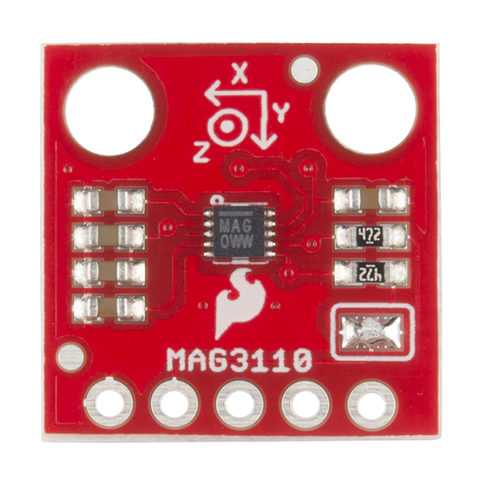
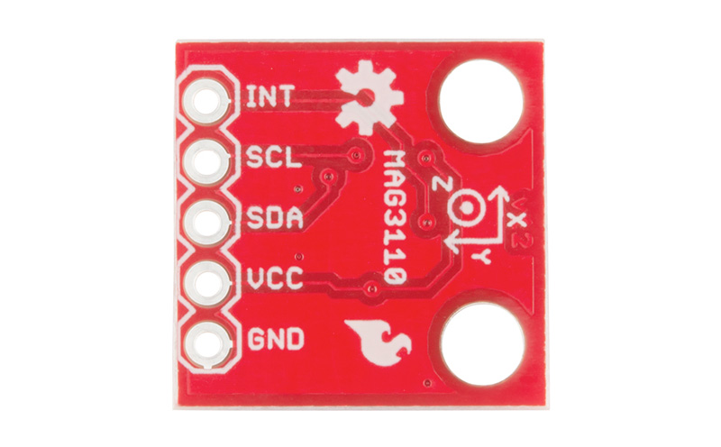
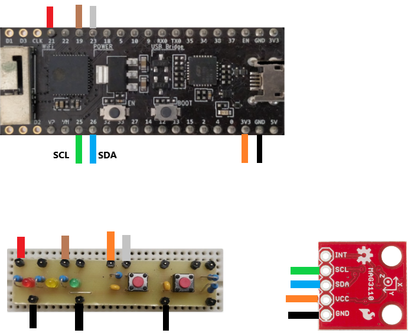

# T01B06: Projeto com magnetómetro MAG3110 com interface I2C
### Autores: Francisco Salgado, Juan da Silva
## Sumário
* [Introdução](#tag_sec_um)
* [Esquema de Montagem](#tag_sec_a)
* [Hardware](#tag_sec_b)
* [Transmissão da Informação](#tag_sec_c)
* [Código](#tag_sec_d)
* [Conclusão](#tag_sec_f)
* [Referências](#tag_sec_g)

##  Introdução
##### O dispositivo MAG3110 é um magnetómetro de 3 eixos de baixa potência fabricado pela Sparkfun que, tal como o nome sugere, deteta a presença de campos magnéticos através de 3 sensores, que operam em eixos diferentes (x,y,z), sendo até possivel medir a sua intensidade. Estes eixos estão localizados no magnetómetro e orientam os diferentes acelerómetros que conseguem recolher dados atuais referentes às orientações dos campos magnéticos terrestres e criar, por exemplo, uma bússola eletrónica. 
#####   O magnetómetro apresenta uma gama de tensões de alimentação entre os 1,95V e 3,6V, não devendo o utilizador ultrapassar estes valores para não danificar o dispositivo. Outras propriedades do magnetómetro são:
   * ##### Amplitude máxima de medição em cada eixo: ±1000 uT
   * ##### Sensilibilidade: 0.1 uT
   * ##### Temperatura de operação: -40°C to +85°C
   * ##### Baixa-potência, modo de medição "one shot"
   * ##### 400 kHz (Fast mode) e 100 compatível kHz (normal mode) com interface I2C

#####  Mais especificações como elétricas podem ser encontradas na datasheet deste componente <a href=https://www.nxp.com/docs/en/data-sheet/MAG3110.pdf>[1]</a>.

##### As suas principais aplicações são a utilização do  dispositivo como uma bússola eletrónica independente, como referido, e também na utilização de serviços baseados em localização. 

##### Neste projeto iremos utilizar o MAG3110 como uma bússola, programando a leitura de dados brutos magnéticos e apresentando a orientação dos pontos cardeais em relação à posição do dispositivo. O programa premitirá também utilizar o magnetómetro para medir a intensidade do campo magnético e a sua orientação em cada componente. Para isso, estará conetado a um microprocessador ESP32 pelo barramento I2C, que servirá de interface para o programa propriamente dito. A linguagagem de programação utilizada foi o MircoPython, tendo se utilizado a plataforma Visual Studio Code; a ligação ao ESP32 é através de um cabo USB-microUSB.

##  Hardware
##### O dispostivo consiste numa placa 15x15 mm vermelha com um referencial cartesiano 3D localizado de acordo com a orientação dos sensores magnéticos, sendo que o eixo z representa o eixo transversal à placa. Apresenta também um circuito integrado com vários pinos sendo que 5 deles estão disponíveis para ligação externa:  
* #####  VCC: alimentação externa (até 3,6V);
* #####  GND: ligação à terra;
* #####  SDA: "Serial data pin" para a ligação I2C; é o pin responsável pela transmissão dos bits de dados;
* #####  SDL: "Serial clock pin" para a ligação I2C; responsável pelo sinal de clock que monitoriza a trasmissão de dados;
* #####  INT: "Interrup pin" que se ativa (retorna 1) quando novos dados estão prontos a ser lidos e retorna 0 após a leitura.

##  Esquema de Montagem
##### Montou-se o circuito consoante o seguinte esquema:

##### Este componente em específico já vem com as reistências de PULL_UP incorporadas no circuito impresso que se deveria colocar nas saídas I2C (antes dos pins SDA e SCL). O valor das resistências de pull_up dependem das características do clock i2C e da capacidade de armazenamento do barramento i2c, sendo que cada modo de operação do magnetómetro requer um  valor específico de resistência pull_up. Como este dispositivo ja apresenta estas resistências incorporadas, adequadas quer opere em fast ou nomal mode, não é preciso colocá-las no circuito.

##  Transmissão da Informação

##### O percurso da informação propriamente dita começa na leitura bruta dos dados por parte dos sensores x,y e z. Os sensores estão conetados a um multiplexador que transforma as 3 entradas de informação numa só saída, compilando os valores analógicos dos diferentes sensores numa sequência única. Posteriormente, um ADC incorporado converte os dados analógicos em digitais, isto é, em bits. Desta forma, a sequência de bytes apresenta 2 bytes de informação relativas a cada eixo (16 bits), ou seja, de cada sensor, sendo possível ler independentemente cada eixo. Depois do processamento e controlo dos sinais digitais estes são enviados através dos pins SDA, SCL e INT que é recebida pelo microprocessador ESP32. Através do software MicroPython é possível processar a informação recebida e convertê-la novamente em sinais analógicos para a sua visualização.

##### O dispositivo consegue recolher dados com intervalos de 12,5 ns o que corresponde a frequência de saída de dados (output data rate: ODR) de 80 Hz, ou seja, 80 datasets por segundo.
##### Além disso, a taxa de amostragem máxima (over sampling ratio: OSR) que consiste no número de samples para fazer a média para 1 medição é 16 samples. Estas configurações de recolha de dados são de certa forma standard, uma vez que são as recomendadas pela datasheet e permitem potencializar ao máximo a velocidade da leitura e escrita de dados. Serão também as utilizadas neste trabalho.

##### O barramento I2C funciona através de 2 sinais SCL e SDA, transmitidos pelos respetivos pinos. A operação é iniciada pelo envio de uma start condition - high to low bit - uma vez que é ativo ao nível baixo; segue-se o envio 8 bits, 7 com o endereço do slave, que depende do register utilizado (definidos no código) e o último bit que define se a operação será de escrita (0) ou leitura (1), isto é, se o ESP32 esté a transmitir ou receber dados do MAG3110. Depois de enviado e confirmado o endereço do registo, segue-se a tramissão dos bits de informação em low e posteriormente um stopt bit.
##### Tanto na leitura ou escrita de um bit ou mais bits segue-se este processo descrito anteriormente com último bit do endereço do slave em 0 (write). No entanto, para a leitura, depois do envio do endereço do registo, segue-se o envio de 8 bits com o enderço do slave (magnetómetro) com o último bit em 1 para a leitura de dados. Só aí estes são transmitidos ao ESP32. 

##  Código
##### Este processo de leitura e escrita está relacioando com o modo como o ESP32 através do python e do barramento I2C processa as funcões utilizadas no código. As funções utilizadas da biblioteca i2c e ustruct foram fulcrais para isso. Ao chamar alguma função da bilioteca i2c para ler ou escrever dados utilizou-se os register do slave adequado, definido no princípio do main(). O código encontra-se comentado linha a linha sendo que é auto explicativo mas segue-se uma explicação breve das funções definidas:

* #### boot
##### É a primeira secção do programa que corre tendo-se utilizado o register WHO_AM_I para recolher o endereço deste modo específico do MAG3110. Funciona como uma confirmação de conexão e identificação do dispositivo.

* #### reset()
##### Reinicia a biblioteca (limpa a cage dos bits) e inicializa o MAG3110 

* #### set_offset()
##### Define um valor inteiro para todos os eixos do Magnetómetro (x,y,z)

* #### enter_standby()/exit_standby()
##### Limpam a cache dos bits para entrar/sair do modo standby e devem ser chamados quando se entra e sai do modo ativo (aquisição de dados)

* #### calibration()
##### Ativa a calibração do magnetómetro, chamando as funções que incorporam o processo. Deve-se calibrar sempre o dispostivo quando se inicializa uma vez que este é um sensor magnético e a existência de campos magnéticos estáticos nas redondezas pode afetar as leituras. A calibração previne a incorreta recolha de dados.

* #### DR_OS()
##### Chamada na calibração. Define o output data rate e o over sampling ratio conforme as configurações referidas anteriormente para a aquisição de dados.

* #### read()
##### Lê os dados brutos do campo magnético x, y e z, convertendo-os em bits e apresentando-os num tuplo

* #### step_calibration()
##### Recolhe os dados da calibração do magnetómetro. A calibração termina automaticamente quando forem recolhidos dados suficientes (cerca de 5-15 segundos).

* #### data_ready()
##### Retorna True se novos dados estão prontos a ser utiizados, utilizando o register DR_STATUS para esta finalidade.

* #### cardinal_points()
##### Retorna a orientação, em graus entre 0 e 360, dos pontos cardeais em relação ao eixo x do magnetómetro ("apontador" da bussola). estes cálculos são feitos através do norte caluclado através da função compass()

* #### compass()
##### Calcula a orientação do norte magnético em graus tendo em conta os dados de x e y recolhidos da orientação do campo magnético terrestre.

* #### print_coords()/print_compass()
##### Imprime as coordenadas magnéticas instantâneas/a orientação dos pontos cardeais em graus instantâneos

* #### continuos_data()
##### Imprime as coordenadas magnéticas reais de 5 em 5 segunos. 

##  Discussão e Conclusão
##### A realização do trabalho permitiu maior compreensão acerca de como controlar dispositivos através do microcontrolador Esp32. Conseguimos obter dados do chip mag3110 para obter informações sobre o campo magnético. Durante a realização do trabalho tivemos algumas dificuldades que nos impediram de realizar um trabalho mais elaborado como pretendido. Não conseguimos compreender totalmente como dar uso ao pin Int, que segundo a datasheet é um pino que se ativa quando novos dados foram adquiridos e estão prontos a ser recolhidos. Desta forma, tentamos fazer a interrupção da leitura dos dados através de botões o que também não foi conseguido. Tentamos implementar outros botões, mas não se estava a fazer a correta aplicação dos interrupts, pelo que se elaborou uma interface digital que recolhe instruçõs através do micropython. Contudo, percebeu-se e utilizou-se com sucesso grande parte dos registers referidos na datasheet que referem instruções ao modo de operação. 
##### Queriamos também ter dimensionado um servidor para realizar um programa que representasse graficamente os dados obtidos continuamente pelo mag3110, já que inicialmente pensavamos ser possível observar gráficos diretamente no vscode. Dispendeu-se algum tempo a tentar realizá-lo, o que poderia ter sido ser útil para analisar, por exemplo, a perturbação que objetos com características magnéticas (como por exemplo os ímans dos frigoríficos) provocam ao serem aproximados ao chip. A função de leitura de dados contínuos foi projetada inicialmente com esse mesmo objetivo.
##### A nível de código percebeu-se a importância e utilidade de certas bibliotecas para a programação de dispositivos, umz vez que tornam todo o processo mais prático e eficiente.

##  Referências
<a href=https://www.nxp.com/docs/en/data-sheet/MAG3110.pdf name=site> [1] Datasheet magnetómetro MAG3110</a>

<a href=https://www.nxp.com/docs/en/supporting-information/MAG3110FAQS.pdf name=site> [2] MAG3110 Frequently Asked Questions </a>

<a href=https://learn.sparkfun.com/tutorials/mag3110-magnetometer-hookup-guide-/introduction- name=site> [3] MAG3110 Magnetometer Hookup Guide for Arduino </a>

<a href=https://paginas.fe.up.pt/~hsm/docencia/edm/edm-2020-21 name=site> [4] Página docente da disciplina </a>
